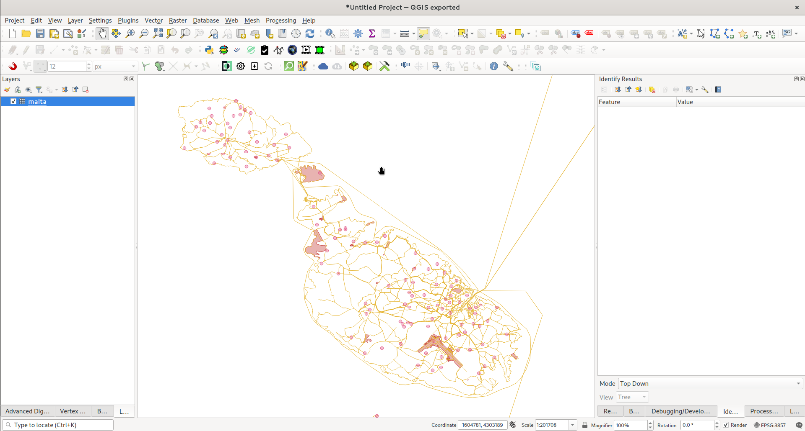
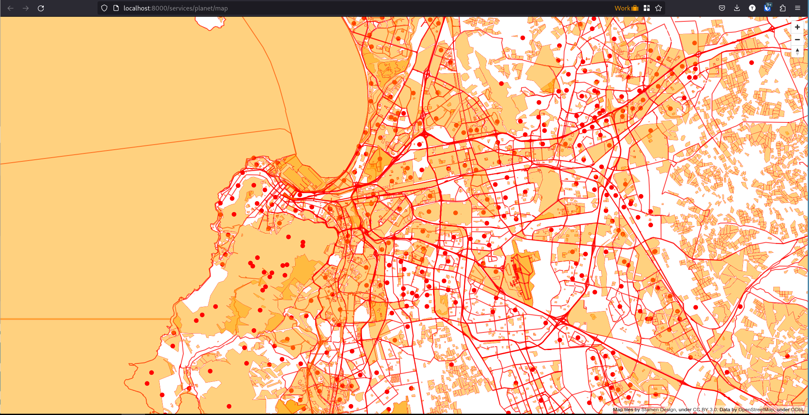
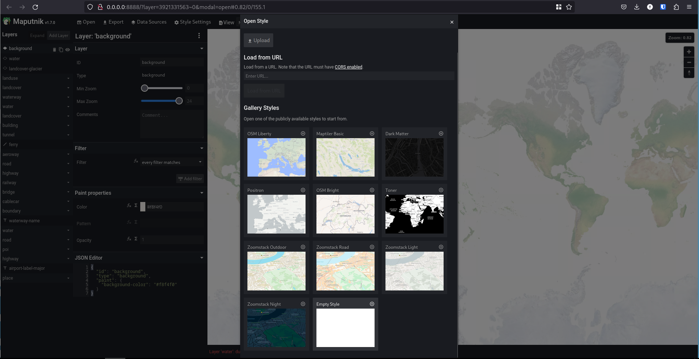
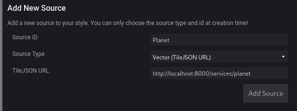
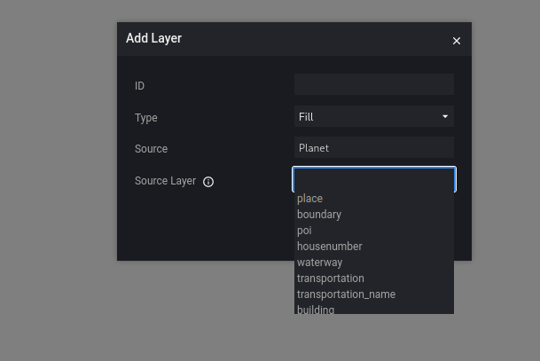

# Processing Sandbox for Vector Tiles


## Pregenerating Coastlines

```
./get_data.sh
time tilemaker --output coastline.mbtiles \
  --bbox -180,-85,180,85 \
  --process process-coastline.lua \
  --config config-coastline.json
```

This will create ``coastline.mbtiles`` which contains all the coastlines later.


## Generating a country

This is optimised for performance:

```
./process_malta.sh
```

You can then drag and drop the resulting mbtiles file into QGIS.



## Generating the world

This is optimised for performance:

```
./process_planet.sh
```

During processing, it will consume around 250GB of temporary storage in the
work directory (this will be expunged afterwards).

You can then drag and drop the resulting mbtiles file into QGIS.


## Creating a Server

The shell.nix included here installs ``mbtileserver`` which I use rather than the
bundled tile server in tilemaker. Mbtileserver will publish a tiles.json url too
which will allow tools like maputnik editor to pick up all the layers etc. in 
your tileset.


```
./run_server.sh
```


After starting the server, you can find the service list at:

http://localhost:8000/services/

Clicking on an individual service will give you the urls and schema for that service e.g.

http://localhost:8000/services/planet

If you click the map url it will let you browse the (unstyled) tiles interactively e.g.



## Editing in maputnik editor

Leave the mbtileserver running and then run maputnik editor in a docker container:

```
docker run -it --rm -p 8888:8888 maputnik/editor
```

Then open your browser at the editor url:

http://0.0.0.0:8888/

Then click ``Open`` then choose ``empty style``



Then add a datasource ``Data Sources`` 



Then you can do add layer and select layers from the planet source:




## Credits

Tim Sutton (tim@kartoza.com)
Jeremy Prior (jeremy@kartoza.com)
