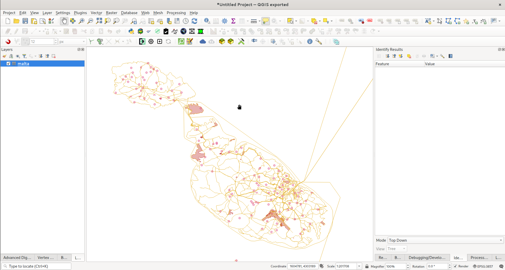
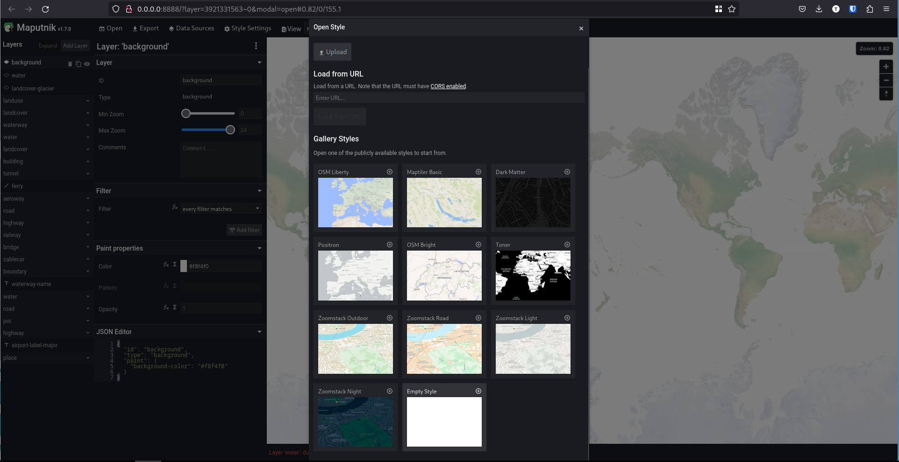
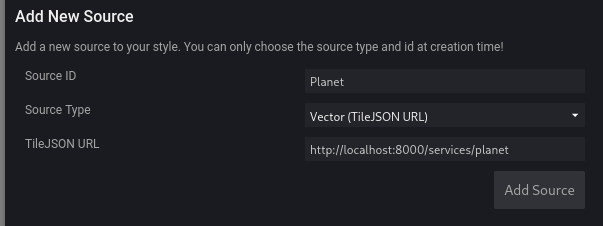
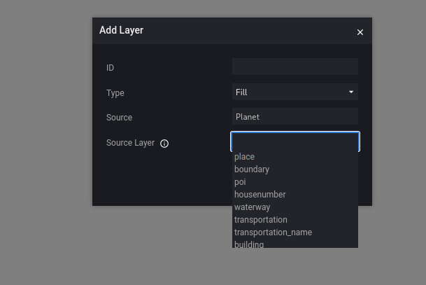

# Tilemaker Workflows

**OpenMapTiles-compliant vector tile generation from OpenStreetMap data at any scale.**

Generate beautiful, standards-compliant vector tiles from country extracts to the entire planet using [Tilemaker](https://tilemaker.org), serve them through a single unified endpoint, and style them with 22 bundled MapLibre GL styles — all within a reproducible Nix flake environment.

[](https://nixos.org)
[](https://openmaptiles.org/schema/)
[](https://github.com/kartoza/tilemaker-workflows/pkgs/container/tilemaker-workflows)

---

## Table of Contents

- [Quick Start](#quick-start)
- [Docker](#docker)
  - [Pull from GHCR](#pull-from-ghcr)
  - [Docker Compose](#docker-compose)
  - [Building the Image Locally](#building-the-image-locally)
- [Architecture](#architecture)
  - [Request Routing](#request-routing)
- [Workflows](#workflows)
  - [Coastline Generation](#coastline-generation)
  - [Country Processing](#country-processing)
  - [Planet Processing](#planet-processing)
  - [Tile Serving](#tile-serving)
  - [Style Editing with Maputnik](#style-editing-with-maputnik)
- [Bundled Styles](#bundled-styles)
- [Viewing Tiles](#viewing-tiles)
  - [Web Viewer](#web-viewer)
  - [QGIS](#qgis)
  - [Embedding in Web Pages](#embedding-in-web-pages)
- [Development](#development)
  - [Prerequisites](#prerequisites)
  - [Nix Run Commands](#nix-run-commands)
  - [Make Targets](#make-targets)
  - [Pre-commit Hooks](#pre-commit-hooks)
  - [Neovim Integration](#neovim-integration)
- [CI/CD](#cicd)
- [Data Sources & Attribution](#data-sources--attribution)
- [Credits](#credits)

---

## Quick Start

```bash
# 1. Enter the dev environment
nix develop

# 2. Generate Malta tiles (fast, good for testing)
nix run .#processMalta

# 3. Serve tiles locally (opens browser automatically)
nix run .#serve

# 4. Browse at http://localhost:8080/viewer.html
```

---

## Docker

The Docker image bundles everything needed to serve vector tiles: nginx, mbtileserver, 22 MapLibre GL styles, sprite sheets, and pre-rendered fonts. Just bring your own `.mbtiles` files.

### Pull from GHCR (Kartoza members only)

> **Note:** The pre-built GHCR image is only available to authenticated [Kartoza](https://kartoza.com) organisation members. External users should [build the image locally](#building-the-image-locally) instead.

```bash
# Authenticate with GitHub Container Registry (requires a PAT with read:packages scope)
echo $GITHUB_TOKEN | docker login ghcr.io -u USERNAME --password-stdin

docker pull ghcr.io/kartoza/tilemaker-workflows:latest

# Run with your .mbtiles directory
docker run -d -p 8080:80 -v /path/to/tiles:/data:ro ghcr.io/kartoza/tilemaker-workflows:latest
```

Then browse:

| Endpoint | URL |
|----------|-----|
| Web viewer | http://localhost:8080/viewer.html |
| TileJSON services | http://localhost:8080/services/ |
| Style JSON files | http://localhost:8080/styles/ |
| Font glyphs (PBF) | http://localhost:8080/fonts/ |
| Sprite sheets | http://localhost:8080/sprites/ |

### Docker Compose

```yaml
services:
  tilemaker-server:
    image: ghcr.io/kartoza/tilemaker-workflows:latest
    restart: unless-stopped
    ports:
      - "8080:80"
    volumes:
      - ./output:/data:ro
    environment:
      - DATA_DIR=/data
```

```bash
docker compose up -d
```

The container will fail to start if no `.mbtiles` files are found in the mounted data directory — this is intentional to provide a clear error message.

### Building the Image Locally

```bash
# Using Make
make build-docker

# Or step by step
nix build .#dockerImage -o result
docker load < result
nix run .#getData              # downloads fonts
docker build -t tilemaker-server:latest -f Dockerfile .

# Run locally-built image
docker run -d -p 8080:80 -v ./output:/data:ro tilemaker-server:latest
```

---

## Architecture

```
tilemaker-workflows/
├── flake.nix                 # Nix flake (dev shell, apps, docker image, checks)
├── Makefile                  # Make targets for all common operations
├── Dockerfile                # Layers fonts onto Nix-built base image
├── docker-compose.yml        # Single-command tile server deployment
├── docker-entrypoint.sh      # Container entrypoint (nginx + mbtileserver)
├── nginx.conf                # Nginx config (reverse proxy + static serving)
├── build_docker.sh           # Build & load Docker image with stats report
├── config.json               # Full OpenMapTiles layer configuration (z0-14)
├── config-coastline.json     # Coastline-only layer configuration
├── process.lua               # Main Lua processing script (OpenMapTiles v3)
├── process-coastline.lua     # Coastline/landcover remap script
├── get_data.sh               # Download Natural Earth, OSM water & font data
├── process_malta.sh          # Malta country tile workflow
├── process_planet.sh         # Planet-scale tile workflow
├── run_server.sh             # Local tile server (nginx + mbtileserver)
├── run_maputnik_editor.sh    # Maputnik editor launcher
├── viewer.html               # MapLibre GL viewer with style switcher
├── generate_sprites.py       # Download Maki/Temaki icons & build sprite sheets
├── add_icons_to_styles.py    # Add icon layers to all styles
├── ATTRIBUTION.md            # Full data & asset provenance
├── styles/                   # 22 MapLibre GL styles
├── sprites/                  # Generated sprite sheets (Maki + Temaki + custom)
├── fonts/                    # Pre-rendered PBF font glyphs
├── .github/workflows/
│   └── docker.yml            # CI: build & push Docker image on PR/release
├── landcover/                # Natural Earth shapefiles
├── img/                      # Documentation screenshots
└── maputnik/                 # MapLibre Maputnik (git submodule)
```

### Request Routing

All services are exposed through a single nginx reverse proxy on port 80 (mapped to 8080 on the host). This provides a unified access point for tiles, styles, fonts, and the web viewer:

```
                          ┌─────────────────────────────────────────┐
                          │           Docker Container              │
                          │                                         │
  Client ──► :8080 ──────►│  nginx (:80)                            │
                          │  │                                      │
                          │  ├── /viewer.html ──► /static/          │
                          │  ├── /styles/     ──► /static/styles/   │
                          │  ├── /fonts/      ──► /static/fonts/    │
                          │  ├── /sprites/    ──► /static/sprites/  │
                          │  │                                      │
                          │  └── /services/   ──► mbtileserver      │
                          │                       (:8000 internal)  │
                          │                       │                 │
                          │                       └── /data/*.mbtiles│
                          └─────────────────────────────────────────┘
```

**nginx** handles two roles:

1. **Static file serving** — The root location (`/`) serves the web viewer, style JSON files, font PBF glyphs, and sprite sheets directly from `/static/` inside the container.

2. **Reverse proxy** — Requests to `/services/` are proxied to **mbtileserver** running on internal port 8000, which serves TileJSON metadata and vector tile PBF data from `.mbtiles` files.

This means clients only need to know a single host/port. Style JSON files reference tile URLs at `/services/` and font URLs at `/fonts/` using relative paths, so everything works together without cross-origin configuration.

**Data flow:**

```
OSM PBF → [osmium optimise] → tilemaker (Lua + JSON config) → .mbtiles
                                                                  │
                                                                  ▼
                                               mbtileserver → TileJSON + PBF tiles
                                                                  │
                                                                  ▼
                                               nginx → unified endpoint → MapLibre / QGIS
```

---

## Workflows

### Coastline Generation

Pre-generate global coastline, water polygon, and landcover tiles:

```bash
nix run .#coastline
```

This downloads required Natural Earth and OSM water polygon data, then generates `coastline.mbtiles` covering the full extent (-180,-85,180,85).

### Country Processing

Process individual country extracts (fast iteration for style development):

```bash
nix run .#processMalta
nix run .#processSouthAfrica
```

Downloads the latest OSM extract from Geofabrik and processes it with performance optimisations (`--fast`, `--no-compress-ways`, `--no-compress-nodes`).



### Planet Processing

Generate tiles for the entire OpenStreetMap planet:

```bash
nix run .#processPlanet
```

> **Note:** Requires ~250GB temporary storage in the `work/` directory during processing. The planet PBF download is ~70GB.

The workflow:
1. Downloads `planet-latest.osm.pbf` from OpenStreetMap
2. Optimises with `osmium cat` for faster tilemaker processing
3. Generates `planet.mbtiles` at zoom levels 0-14

### Tile Serving

Serve any `.mbtiles` files through the unified nginx endpoint:

```bash
nix run .#serve       # Start on port 8080 (opens browser)
nix run .#stopServe   # Stop all running tile servers
```

The local server uses the same nginx + mbtileserver architecture as the Docker container, providing identical behaviour for development.

### Style Editing with Maputnik

With the tile server running, launch [Maputnik](https://maplibre.org/maputnik/) for visual style editing:

```bash
nix run .#maputnik
```

Then:
1. Open http://localhost:8888/
2. Click **Open** then **Empty style**
3. Add a data source pointing to `http://localhost:8080/services/planet`
4. Add layers from your tile source





---

## Bundled Styles

The project includes 22 MapLibre GL styles, each with full icon support via Maki + Temaki sprite sheets:

| Style | Description |
|-------|-------------|
| **classic** | Warm natural tones, the default |
| **osm** | OpenStreetMap-inspired familiar colours |
| **kartoza** | Kartoza brand teal & orange |
| **muted** | Soft, understated analysis backdrop |
| **grayscale** | Pure greyscale, no colour |
| **noir** | Pure black monochrome |
| **neon** | Dark cyberpunk glow |
| **matrix** | Green-on-black terminal aesthetic |
| **infrared** | Thermal / heat-map colour ramp |
| **hazard** | High-visibility warning colours |
| **blueprint** | Technical blueprint, white on blue |
| **african** | Vibrant earth tones |
| **psychedelic** | Bold saturated colours |
| **panopoly** | Pantone Colors of the Year 2016-2025 |
| **beach-ball** | Bright playful primary colours |
| **biologic** | Biodiversity basemap with organic tones |
| **scifi** | Minority Report futuristic |
| **sketch** | Pencil on aged paper |
| **sketch2** | Hand-drawn Moleskine notebook |
| **ye-olde** | Antique cartographic with italic labels & shadows |
| **pointillist** | Everything rendered as icons and dots |
| **places** | Labels-only overlay for thematic maps |

All styles are served at `http://localhost:8080/styles/<name>.json` and can be used directly with MapLibre GL JS, QGIS, or any vector tile client.

---

## Viewing Tiles

### Web Viewer

The built-in MapLibre GL viewer includes a style switcher for all 22 themes:

```
http://localhost:8080/viewer.html
```

### QGIS

Add tiles as a **Vector Tile** layer in QGIS:

1. **Layer** then **Add Layer** then **Add Vector Tile Layer**
2. Click **New Generic Connection**
3. Set the fields:
   - **Name:** `Planet Tiles`
   - **URL:** `http://localhost:8080/services/planet/tiles/{z}/{x}/{y}.pbf`
   - **Min Zoom:** `0`
   - **Max Zoom:** `14`
   - **Style URL:** `http://localhost:8080/styles/classic.json`
4. Click **OK**, then **Add**

> **Tip:** Replace `planet` with `malta` or any other dataset name matching your `.mbtiles` filename. Replace `classic` with any style name from the table above.

### Embedding in Web Pages

Use the style JSON files directly with MapLibre GL JS:

```html
<script src="https://unpkg.com/maplibre-gl/dist/maplibre-gl.js"></script>
<link href="https://unpkg.com/maplibre-gl/dist/maplibre-gl.css" rel="stylesheet" />
<div id="map" style="width:100%;height:400px;"></div>
<script>
new maplibregl.Map({
  container: "map",
  style: "http://localhost:8080/styles/classic.json",
  center: [0, 20],
  zoom: 2
});
</script>
```

For production, host the style JSON and update the `tiles` URL in the style file to point to your public tile server.

---

## Development

### Prerequisites

- [Nix](https://nixos.org/download.html) with flakes enabled
- [direnv](https://direnv.net/) (recommended)

```bash
# Enter the development shell
nix develop

# Or with direnv (automatic on cd)
direnv allow
```

### Nix Run Commands

| Command | Description |
|---------|-------------|
| `nix run .#getData` | Download required Natural Earth, OSM & font data |
| `nix run .#processMalta` | Generate Malta vector tiles |
| `nix run .#processSouthAfrica` | Generate South Africa vector tiles |
| `nix run .#processPlanet` | Generate planet-scale vector tiles |
| `nix run .#coastline` | Generate coastline/landcover tiles |
| `nix run .#serve` | Start tile server on port 8080 |
| `nix run .#stopServe` | Stop all running tile servers |
| `nix run .#maputnik` | Launch Maputnik style editor |
| `nix run .#lint` | Run shellcheck + luacheck |
| `nix fmt` | Format Nix files (nixfmt-rfc-style) |

### Make Targets

| Target | Description |
|--------|-------------|
| `make help` | Show all available targets |
| `make get-data` | Download required geodata |
| `make process-malta` | Generate Malta vector tiles |
| `make process-south-africa` | Generate South Africa vector tiles |
| `make process-planet` | Generate planet vector tiles |
| `make coastline` | Generate coastline tiles |
| `make serve` | Start tile server on :8080 |
| `make stop-serve` | Stop all running tile servers |
| `make maputnik` | Launch Maputnik style editor |
| `make lint` | Run linters |
| `make fmt` | Format Nix files |
| `make build-docker` | Build Nix-based Docker image locally |
| `make docker-up` | Start tile server container |
| `make docker-down` | Stop tile server container |

### Pre-commit Hooks

Pre-commit hooks are automatically installed when entering the dev shell:

- **shellcheck** — Lint shell scripts
- **luacheck** — Lint Lua processing scripts
- **nixfmt-rfc-style** — Format Nix files
- **trim-trailing-whitespace** — Clean up trailing spaces
- **end-of-file-fixer** — Ensure files end with newline
- **check-added-large-files** — Prevent accidental large file commits

Run all hooks manually:

```bash
pre-commit run --all-files
```

### Neovim Integration

The project includes `.exrc` and `.nvim.lua` for seamless Neovim integration:

**Project menu** (requires [which-key.nvim](https://github.com/folke/which-key.nvim)):

| Shortcut | Action |
|----------|--------|
| `<leader>pd` | Download geodata |
| `<leader>pm` | Process Malta |
| `<leader>pp` | Process planet |
| `<leader>pc` | Process coastline |
| `<leader>ps` | Start tile server |
| `<leader>pe` | Launch Maputnik editor |
| `<leader>pl` | Run linters |
| `<leader>pf` | Format nix files |
| `<leader>pt` | Run pre-commit checks |
| `<leader>pr` | Open README |
| `<leader>pS` | Open Specification |
| `<leader>pP` | Open Packages |
| `<leader>pg` | Git status |

**Lua LSP** is configured to recognise Tilemaker API globals (no false warnings on `Find`, `Layer`, `Attribute`, etc.).

---

## CI/CD

The GitHub Actions workflow (`.github/workflows/docker.yml`) runs on:

- **Pull requests** — Builds the Docker image, posts a comment with image stats and a download link for the tarball artifact (expires in 7 days).
- **Releases** — Builds the image, pushes it to [GitHub Container Registry](https://github.com/kartoza/tilemaker-workflows/pkgs/container/tilemaker-workflows) with version and `latest` tags, appends a build report with usage examples to the release notes, and attaches the image tarball as a release asset.

The image is built in two stages:
1. **Nix base image** (`nix build .#dockerImage`) — Contains nginx, mbtileserver, styles, sprites, viewer, and all configuration.
2. **Dockerfile layer** — Adds pre-rendered PBF font glyphs on top (these are downloaded at build time, not stored in the repo).

### Security & Transparency

Every build (PR and release) generates:

- **[SBOM (Software Bill of Materials)](https://github.com/kartoza/tilemaker-workflows/releases/latest/download/sbom.spdx.json)** — SPDX JSON listing every package in the container with version, license, and upstream URL.
- **[CVE Scan Report](https://github.com/kartoza/tilemaker-workflows/releases/latest)** — Grype vulnerability scan results with severity, CVSS score, affected package, fix status, and NVD links. See the latest release notes for the full table.

Both reports are included in the release notes and attached as downloadable artifacts on every release.

---

## Data Sources & Attribution

This project relies on open data and open source icon libraries. Full provenance details
are in [ATTRIBUTION.md](ATTRIBUTION.md).

| Source | License | Description |
|--------|---------|-------------|
| [OpenStreetMap](https://www.openstreetmap.org/copyright) | ODbL 1.0 | Map data (roads, buildings, POIs, boundaries, etc.) |
| [Natural Earth](https://www.naturalearthdata.com/) | Public Domain | Urban areas, ice shelves, glaciers |
| [OpenStreetMapData](https://osmdata.openstreetmap.de/) | ODbL 1.0 | Water polygons |
| [OpenMapTiles](https://openmaptiles.org/schema/) | BSD-3-Clause | Vector tile schema |
| [Maki Icons](https://github.com/mapbox/maki) | CC0 1.0 | ~215 cartographic point icons |
| [Temaki Icons](https://github.com/rapideditor/temaki) | CC0 1.0 | ~557 extended map icons |
| [Google Fonts](https://fonts.google.com/) | OFL 1.1 / Apache 2.0 | Display & handwriting fonts |
| [MapLibre GL JS](https://maplibre.org/) | BSD-3-Clause | Web map rendering |
| [Tilemaker](https://tilemaker.org/) | Boost 1.0 | Vector tile generation |

**Map data copyright OpenStreetMap contributors.** See https://www.openstreetmap.org/copyright.

---

## Credits

**Tim Sutton** (tim@kartoza.com) &middot; **Jeremy Prior** (jeremy@kartoza.com)

Made with &#x1F497; by [Kartoza](https://kartoza.com) | [Donate!](https://github.com/sponsors/kartoza) | [GitHub](https://github.com/kartoza/tilemaker-workflows)
