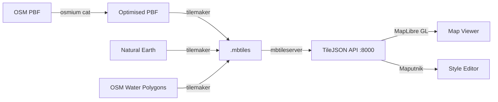
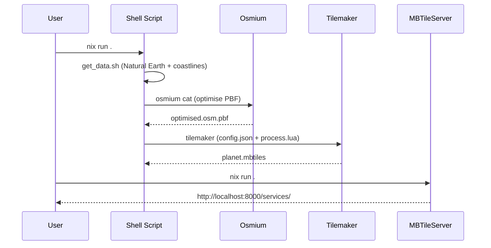

# Tilemaker Workflows — Technical Specification

## Overview

A reproducible workflow system for generating OpenMapTiles-compliant vector tiles from OpenStreetMap data at scales ranging from individual countries to the entire planet. Built on Nix flakes for reproducibility and Tilemaker for tile generation.

---

## User Stories

### US-001: Country-scale tile generation

> As a **map developer**, I want to **quickly generate vector tiles for a single country** so that I can **iterate on styling and configuration without waiting for planet-scale builds**.

**Acceptance criteria:**
- Download latest OSM country extract from Geofabrik
- Process with tilemaker using performance flags
- Output a single `.mbtiles` file
- Complete within minutes for small countries (Malta: < 30s)

### US-002: Planet-scale tile generation

> As a **tile infrastructure operator**, I want to **generate planet-wide vector tiles** so that I can **serve a complete global basemap**.

**Acceptance criteria:**
- Download and optimise planet PBF with osmium
- Process with tilemaker using disk-backed storage
- Handle ~250GB temporary storage requirement
- Output `planet.mbtiles` with zoom levels 0–14

### US-003: Coastline pre-generation

> As a **tile developer**, I want to **pre-generate coastline and landcover tiles separately** so that I can **overlay them with other tile sources**.

**Acceptance criteria:**
- Download Natural Earth urban areas, water polygons
- Generate coastline.mbtiles covering full world extent
- Include water, ocean, landuse, urban areas, landcover, glaciers

### US-004: Local tile serving

> As a **map developer**, I want to **serve generated tiles locally** so that I can **preview them in MapLibre GL or Maputnik**.

**Acceptance criteria:**
- Serve any `.mbtiles` files in the project directory
- Provide TileJSON metadata at `/services/<name>`
- Accessible at http://localhost:8000/

### US-005: Visual style editing

> As a **cartographer**, I want to **visually edit map styles with Maputnik** connected to my local tiles so that I can **design map appearances interactively**.

**Acceptance criteria:**
- Launch Maputnik editor locally (no Docker required)
- Connect to local mbtileserver tile source
- Support empty style creation and layer-by-layer design

### US-006: Reproducible development environment

> As a **developer**, I want a **fully reproducible development environment via Nix** so that I can **start working immediately without manual dependency management**.

**Acceptance criteria:**
- All tools available via `nix develop`
- Pre-commit hooks auto-installed on shell entry
- Shell prompt shows available commands
- `direnv` integration for automatic activation

---

## Functional Requirements

### FR-001: Tile Generation

| ID | Requirement |
|----|-------------|
| FR-001.1 | Generate vector tiles in MBTiles format (PBF encoding, gzip compression) |
| FR-001.2 | Comply with OpenMapTiles schema v3.0 |
| FR-001.3 | Support zoom levels 0–14 (configurable via JSON) |
| FR-001.4 | Support bounding box filtering |
| FR-001.5 | Process OSM nodes, ways, and relations |
| FR-001.6 | Calculate building heights from OSM tags |
| FR-001.7 | Classify POIs according to OpenMapTiles taxonomy |
| FR-001.8 | Compute road z-ordering per Imposm standard |
| FR-001.9 | Support configurable language preference for names |
| FR-001.10 | Simplify geometry at lower zoom levels |

### FR-002: Layer Schema

The following layers are generated (OpenMapTiles v3 compliant):

| Layer | Content | Min Zoom |
|-------|---------|----------|
| `place` | Cities, towns, villages, countries | 0 |
| `boundary` | Administrative boundaries | 0 |
| `transportation` | Roads, railways, paths | 4 |
| `transportation_name` | Road/path names | 6 |
| `water` | Water polygons | 0 |
| `water_name` | Water body names | 0 |
| `waterway` | Rivers, streams | 8 |
| `building` | Building footprints | 13 |
| `housenumber` | Address numbers | 14 |
| `poi` | Points of interest | 12 |
| `aerodrome_label` | Airport labels | 8 |
| `mountain_peak` | Peaks & saddles | 7 |
| `park` | Parks & protected areas | 4 |
| `landuse` | Land use polygons | 4 |
| `landcover` | Natural land cover | 0 |

### FR-003: Data Sources

| Source | URL | Purpose |
|--------|-----|---------|
| OpenStreetMap Planet | planet.openstreetmap.org | Full global data |
| Geofabrik Extracts | download.geofabrik.de | Country/region data |
| Natural Earth 10m Urban | naciscdn.org | Urban area polygons |
| OSM Water Polygons | osmdata.openstreetmap.de | Coastline/ocean data |

### FR-004: Development Environment

| ID | Requirement |
|----|-------------|
| FR-004.1 | Nix flake provides complete development shell |
| FR-004.2 | Pre-commit hooks validate code quality on commit |
| FR-004.3 | `nix run` apps provide one-command workflows |
| FR-004.4 | Neovim project configuration with shortcuts |
| FR-004.5 | Shell prompt displays available commands |
| FR-004.6 | Direnv activates environment automatically |

---

## Architecture

### Processing Pipeline

---

## Configuration

### config.json

- `settings.minzoom`: 0
- `settings.maxzoom`: 14
- `settings.basezoom`: 14
- `settings.compress`: "gzip"
- `settings.filemetadata.format`: "pbf"
- `settings.filemetadata.scheme`: "xyz"

### process.lua

- `preferred_language`: Configurable (default: empty = local names)
- POI classification: Full OpenMapTiles taxonomy
- Z-order calculation: Based on Imposm z_order standard
- Area filtering: Features below threshold excluded at low zooms
- Geometry simplification: 0.0003–0.0005 at zoom < 12

---

## Non-functional Requirements

| ID | Requirement |
|----|-------------|
| NFR-001 | Planet processing must handle 70GB+ input files |
| NFR-002 | Temporary storage up to 250GB during planet builds |
| NFR-003 | Country extracts process in under 5 minutes |
| NFR-004 | Development environment enters in under 30 seconds (cached) |
| NFR-005 | All dependencies pinned via Nix flake lock |
| NFR-006 | Reproducible builds across Linux x86_64 and aarch64 |
